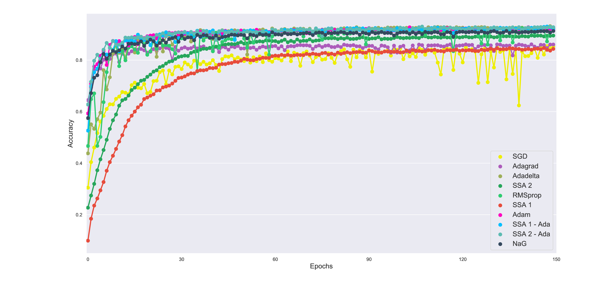

# NEW OPTIMIZATION ALGORITHMS FOR NEURAL NETWORK TRAINING USING OPERATOR SPLITTING TECHNIQUES
## Description
This is the GitHub repository for the article [ NEW OPTIMIZATION ALGORITHMS FOR NEURAL NETWORK TRAINING USING OPERATOR SPLITTING TECHNIQUES](/google.com)

<figure>
	
	<figurecaption>Results on the CIFAR10 Dataset</figurecaption>
</figure>
## Abstract
In the following paper we present a new type of optimization algorithms adapted for neural network training. These algorithms are based upon sequential operator splitting technique for some associated dynamical systems. Furthermore, we investigate through numerical simulations the empirical rate of convergence of these iterative schemes toward a local minimum of the loss function, with some suitable choices of the underlying hyper-parameters. We validate the convergence of these optimizers using the results of the accuracy and of the loss function on the MNIST, MNIST-Fashion and CIFAR 10 classification datasets.
## Requirements
+ pytorch 
+ numpy
+ matplotlib
+ seaborn
+ dill

pip install -r requirements.txt
## Help
```bash
python main.py --help
```
Output:
```
usage: main.py [-h] [--batch-size N] [--test-batch-size N] [--epochs N]
               [--lr LR] [--momentum M] [--q Q] [--k K] [--alpha A] [--eps E]
               [--optim O] [--loss L] [--no-cuda] [--seed S]
               [--log-interval N] [--stoch] [--cifar10] [--fash] [--optimhelp]
               [--losshelp]

PyTorch MNIST Example

optional arguments:
  -h, --help           show this help message and exit
  --batch-size N       input batch size for training (default: 64)
  --test-batch-size N  input batch size for testing (default: 1000)
  --epochs N           number of epochs to train (default: 30)
  --lr LR              learning rate (default: 0.00001)
  --momentum M         SGD momentum (default: 0.0)
  --q Q                q parameter for A5 algorithm (default: 0.01)
  --k K                k parameter for A3/A5 algorithm (default: 2)
  --alpha A            alpha parameter for the RMS running average (default:
                       0.99)
  --eps E              eps parameter for the RMS division by 0 correction
                       (default: 1e-8)
  --optim O            Optimiser to use (default: SGD)
  --loss L             Loss function (default: nll for MNIST, cross-entropy
                       for cifar10
  --no-cuda            disables CUDA training
  --seed S             random seed (default: 1)
  --log-interval N     how many batches to wait before logging training status
  --stoch              use stochastic gradient computation
  --cifar10            Use Cifar10 not MNIST
  --fash               Use MNIST fashion not MNIST
  --optimhelp          Print optim options
  --losshelp           Print loss options
```
```bash
python main.py --optimhelp
```
Output:
```
ASGD
Adadelta
Adagrad
Adam
Adamax
LBFGS
Optimizer
RMSprop
Rprop
SGD
SSA1
SSA2
SparseAdam
```
```bash
python main.py --losshelp
```
Output:
```
AdaptiveLogSoftmaxWithLoss
BCELoss
BCEWithLogitsLoss
CTCLoss
CosineEmbeddingLoss
CrossEntropyLoss
HingeEmbeddingLoss
KLDivLoss
L1Loss
MSELoss
MarginRankingLoss
MultiLabelMarginLoss
MultiLabelSoftMarginLoss
MultiMarginLoss
NLLLoss
NLLLoss2d
PoissonNLLLoss
SmoothL1Loss
SoftMarginLoss
TripletMarginLoss
```
## Usage

```bash
python main.py --stoch --optim SSA1 --lr 0.1
```
runs ssa1 on the MNIST dataset, computing the gradient and taking a step for each mini batch


## Replicate Results

## View Saved Results
```python
import os
import torch
import dill
import models

for root, dirs, files  in os.walk('results'):
    for _f in files:
        with open(os.path.join(root, _f), 'rb') as f:
            data = dill.load(f)
            #do stuff
```
